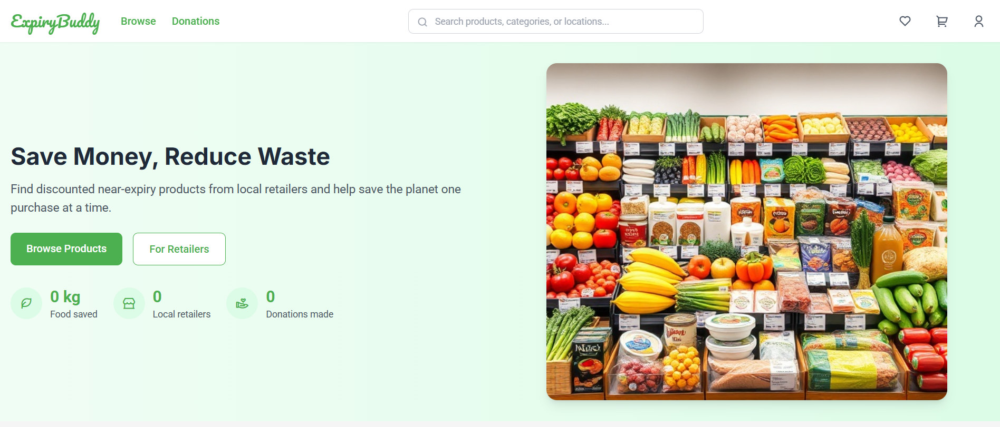
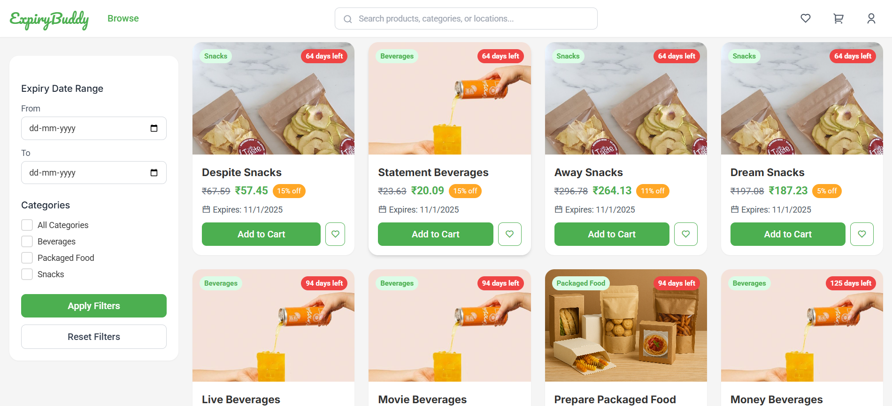
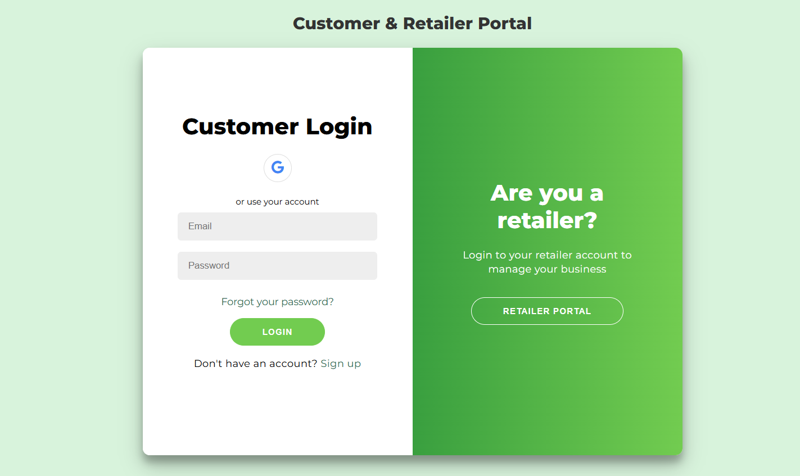

# 🛒 ExpiryBuddy  

A smart platform that connects **retailers** and **customers** by managing **near-expiry products** with **dynamic discounts**, and routing unsold items to **donation or disposal** automatically.  

Link:
https://expiry-buddy.onrender.com/

---

## ✨ Features  

- 📦 **Smart Product Upload**  
  - Retailers enter **Month & Year of expiry** (date optional).  
  - **Perishable detection** handled by hybrid logic (category + expiry gap + retailer flag).  

- ⏳ **Dynamic Discounting (ML-powered)**  
  - Discounts adjust intelligently using past product history.  
  - Encourages faster sales as expiry date approaches.  

- ❤️ **Donation Flow**  
  - **Perishable items** → move to donation **2 days before expiry**.  
  - **Non-perishable items** →  
    - 15 days before expiry → 60% moved to donation  
    - 5 days before expiry → remaining 40% moved  
  - Expired + unsold items → **auto-deleted** (symbolizing compost/disposal).  

- 🔄 **Automated Expiry Management**  
  - Scheduled with `node-cron`  
  - Products seamlessly shift between **store, donation, and disposal**.  

- 🎯 **User-Friendly Interface**  
  - Retailers can upload/manage products effortlessly.  
  - Customers discover discounted products easily.  

---

## ⚙️ Tech Stack  

- **Frontend:** React.js, TailwindCSS, ShadCN UI  
- **Backend:** Node.js, Express.js, MongoDB  
- **Machine Learning:**  
  - **Dynamic Discounting Model** → Learns from past product history to recommend optimal discounts  
- **Scheduling & Automation:** node-cron (for donation & expiry management)  
- **Deployment:** Render (backend + cron), Vercel (frontend)  

---

## 📊 System Workflow  

1. **Product Upload**  
   - Retailer enters expiry info → system classifies as **perishable** or **non-perishable**.  

2. **Discount Assignment**  
   - ML-powered model predicts dynamic discount values.  

3. **Donation Flow**  
   - Products automatically moved to **donation inventory** before expiry.  

4. **Disposal**  
   - Unsold items past expiry → deleted automatically.  

---

## 📸 Screenshots

---

## 💡 Why ExpiryBuddy?

Every year, tons of food goes to waste due to mismanaged expiry dates.  
ExpiryBuddy creates a **win-win system**:  
- Retailers earn more by selling near-expiry stock at discounts.  
- Customers get cheaper products.  
- Communities benefit from donations.  
- Environment wins with reduced waste. 🌍  

---

## ⚙️ Future Enhancements

- 📊 Advanced analytics dashboard for retailers.  
- 📍 Geo-based donation centers integration.  

---

## 👨‍💻 Team

ExpiryBuddy was built with ❤️ by a passionate group of developers from VIT Chennai:

- Saumya Agarwal
- Kavya R
- Meghna Mandawra
- P. Sinthana

---
